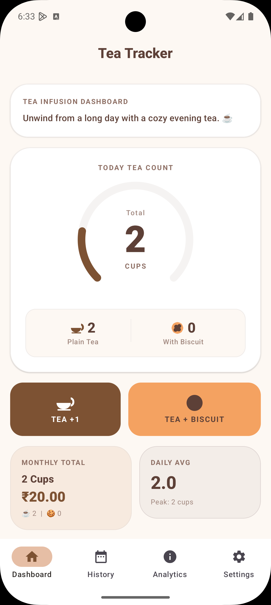
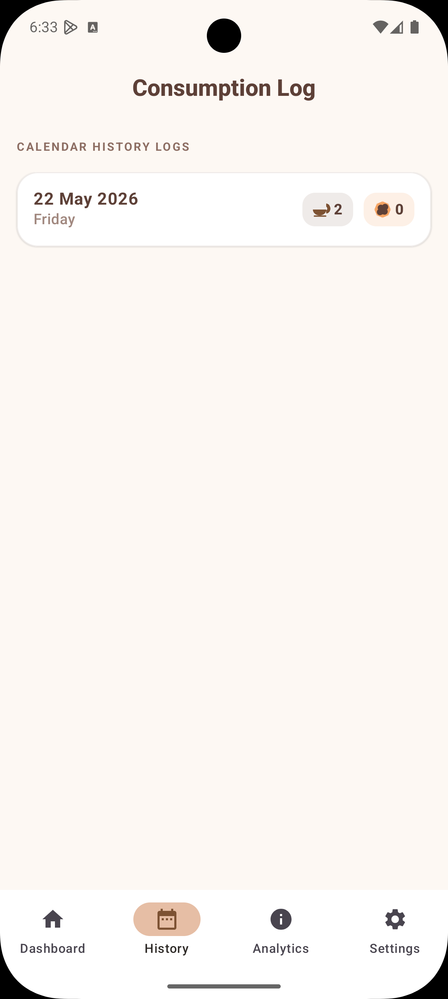
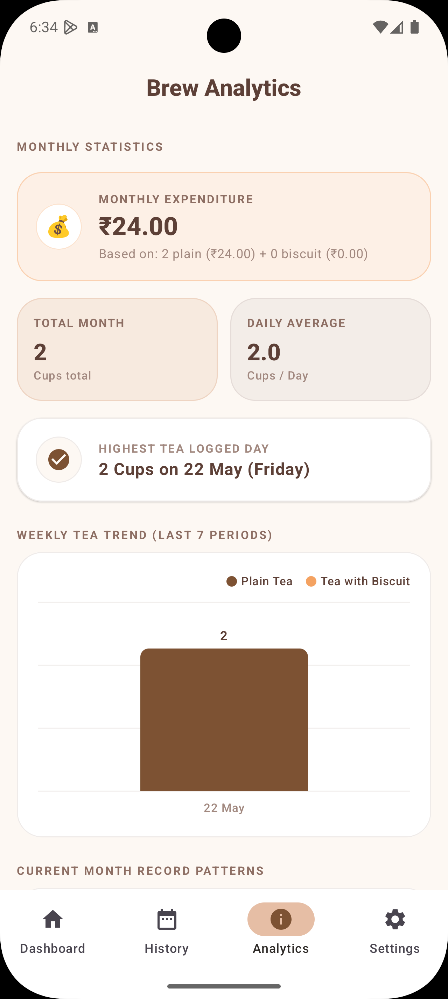
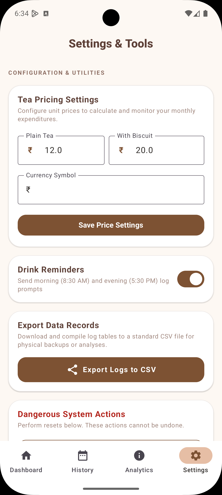

<div align="center">
  
  <h1> Tea Tracker</h1>
</div>

**Tea Tracker** is a lightweight, customizable Android application designed to help you effortlessly log your daily tea and biscuit consumption. Built with modern Android development practices, it features instant-tap home screen widgets so you can log your breaks without even opening the app.

---

## ✨ Features

*   **Quick Logging:** Instantly track your cups of tea and biscuits.
*   **Home Screen Widgets:** One-tap widgets to log your consumption directly from your home screen.
*   **Material Design 3:** A beautiful, responsive, and modern user interface built entirely with Jetpack Compose.
*   **Local Storage:** All your data is securely stored on your device using Room Database.
*   **Customizable:** Easily adaptable for different types of beverages or snacks.

## 📸 Screenshots

| Home Page | History |
| :---: | :---: |
|  |  |

| Analytics | Settings |
| :---: | :---: |
|  |  |

<br>

<div align="center">
  <h3>🎥 App Demo</h3>
  <video src="assets/Recording.gif" width="500" controls="controls">
    Your browser does not support the video tag.
  </video>
</div>

---

## 🛠️ Tech Stack

This project leverages the modern Android development ecosystem:
*   **UI:** [Jetpack Compose](https://developer.android.com/jetpack/compose) with Material 3
*   **Database:** [Room](https://developer.android.com/training/data-storage/room) for robust local SQLite storage
*   **Asynchronous Programming:** Kotlin Coroutines & Flow
*   **Networking / Serialization:** Retrofit & Moshi
*   **Testing:** JUnit, Espresso, and Roborazzi for snapshot testing

## 🚀 Getting Started

### Prerequisites
*   **Android Studio:** (Koala or newer recommended)
*   **JDK:** Version 17+ (Java 11 compatibility configured in build)
*   **Android SDK:** Minimum SDK 24, Target SDK 36

### Installation & Setup

1.  **Clone the repository:**
    ```bash
    git clone https://github.com/HrshD1eux/tea-tracker.git
    ```
    *(Alternatively, just open the existing local folder in Android Studio).*

2.  **Open the project:**
    Launch Android Studio, select **Open**, and navigate to the `tea-tracker` directory.

3.  **Sync Gradle:**
    Allow Android Studio to download the necessary dependencies (like Compose, Room, etc.) and sync the project.

4.  **Keystore Configuration (Optional for Debug):**
    By default, the debug build uses a local `debug.keystore`. If you experience signing errors building locally, you can safely remove or comment out this line in `app/build.gradle.kts`:
    ```kotlin
    signingConfig = signingConfigs.getByName("debugConfig")
    ```

5.  **Run the app:**
    Select your preferred emulator or physical device via USB debugging and click the **Run** ▶️ button in Android Studio.

## 👨‍💻 Developer

Developed by **hrshd1eux**
